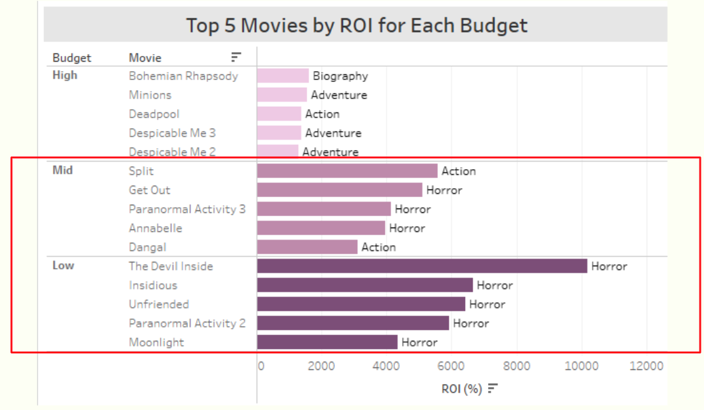
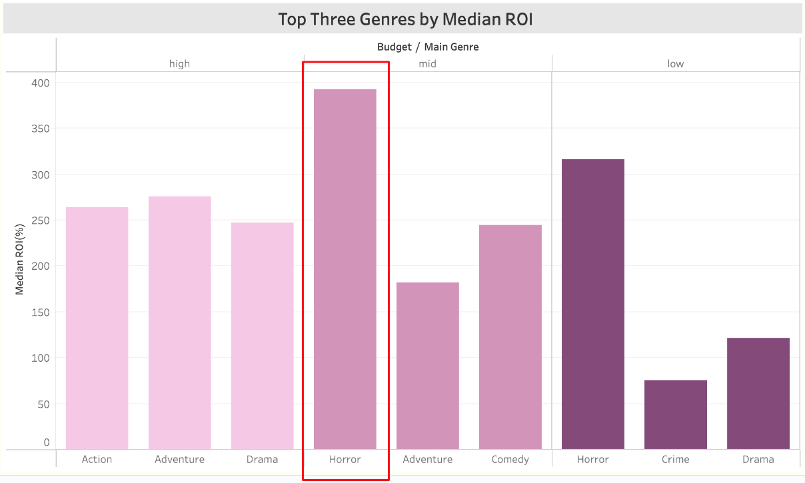
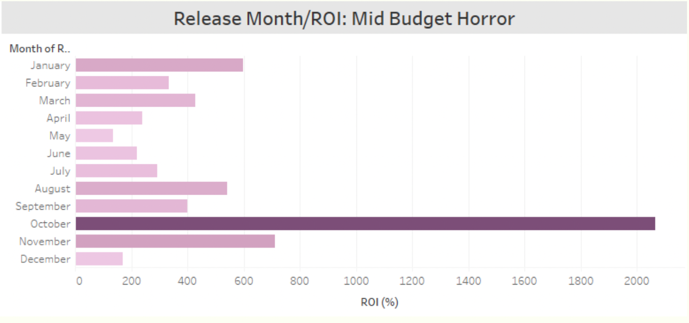
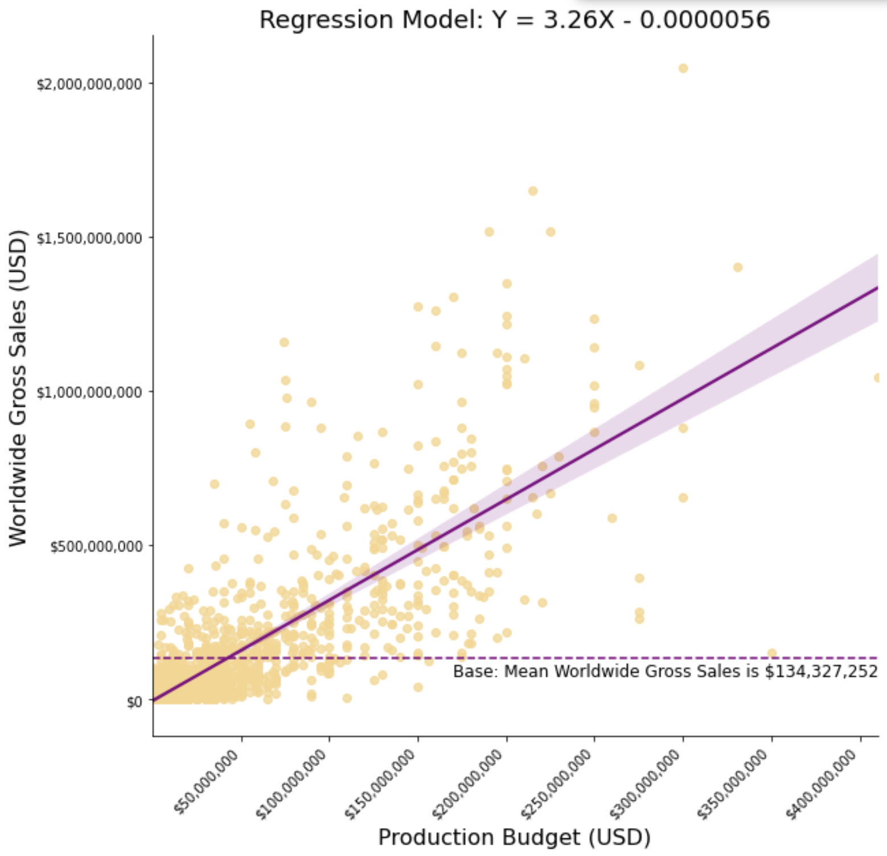

# Thunderhouse Films Box Office Analysis
Authors and Contact Information: 
- [Lillian Lakes](https://github.com/lillianlakes) [(GitHub Lead)](https://www.linkedin.com/in/lillianlakes/)
- [Madeleine Smithers](https://github.com/MaddieSmithers) [(Technical Lead)](https://www.linkedin.com/in/madeleinesmithers/034123/)
- [Stuart Clark](https://github.com/sclarkHOU) [(Presentation Lead)](https://www.linkedin.com/in/stuart-clark-185034123/)

## For More Information
To explore our findings further, please review the full analysis in the [Jupyter Notebook](box_office_analysis.ipynb) or view our [Project Deck](box_office_presentation.pdf). 

## Overview

This project presents an analysis of past film data that aims to provide concrete recommendations to Thunderhouse Films, an emerging film studio. It analyzes production budgets, box office revenue, genres, and release times in order to predict the most profitable strategy for producing and releasing films. Descriptive analysis and regression analysis of production budget and gross sales data show that horror films in the mid-budget range bring in the highest returns on investment, especially when released in the weeks leading to Halloween. Thunderhouse films can use our analysis to target movies with the highest ROI as they launch their new movie studio and later expand.

## Business Problem

Entering the movie business requires a certain level of risk and capital allocation. By analyzing data of past films, we hope to devise a strategy that will make the most effective use of each dollar our client spends as a new film studio. The most important metric in this case is the Return on Investment (ROI) from each film, since producing a film is an expensive endeavor and we want to ensure the payoff is maximized. We saw three main categories that a new entrant into the industry would need to consider. These include how much to spend on a film, what genre to produce, and when to release the film. We first start off by segmenting the market into low, mid, and high-budget films, as these three segments all differ in their optimal strategy. We then use the main genre associated with each film to look across our market segments for the highest median ROI, in order to account for outliers. Finally, we assess the best time to release a film by analyzing our top genre across each month of the year to find where films repeatedly yield high returns. 

## Data Understanding

Our initial data comprised of datasets from [Box Office Mojo](https://www.boxofficemojo.com/), [IMDB](https://www.imdb.com/), [Rotten Tomatoes](https://www.rottentomatoes.com/), [TheMovieDB](https://www.themoviedb.org/), and [The Numbers](https://www.the-numbers.com/). For our specific goals of analyzing budget ranges, genres, and release dates, we decided to use data from The Numbers and IMDB, as these were the most informative and robust for our purposes. We did notice limitations in our available data from the beginning, including the lack of additional revenue streams outside of the box office, missing information on costs to produce films which would have complemented production budget data, and not accounting for inflation. After appropriate data cleaning and exploration, we decided to filter out films that were not released theatrically since we could only compare revenue from the box office. We also decided to only use data on films released between 2010 and 2020, since this window is where we had the most reliable data. 

## Methods

This project uses descriptive analysis, including snapshots of top movies and top genres by median ROI for each budget category and a display of median ROI by month of release for the mid-budget horror category, to support our recommendations. We decided to use ROI because this is a film industry standard when analyzing alternative projects. We also ran a regression to show how much variation in worldwide gross sales is explained by production budget and further support our decision to use ROI as a metric since we calculate ROI as worldwide gross sales divided by production budget multiplied by 100.

## Results

To figure out what might be an optimal budget range to spend on a movie, we looked at the ROI by production budget. The below chart shows the ROI for the top five films in each of our three budget categories. **The mid and low budget categories outperform high, with the horror genre clearly dominating both budget categories as the most lucrative investment**.

Next, we looked at the median ROI by genre to figure out what types of genres are most profitable. Again, horror movies stand out, with the mid-budget category having the highest ROI of all. **Especially for budgets below $50M, the horror genre is the way to go with the highest return**.

We delved deeper into the mid-budget horror category to identify the best time to release by analyzing median ROI by month. We found that October is an optimal time to release, which makes sense because this is right around Halloween. **For the mid-budget horror genre, we recommend targeting marketing and timing towards an early October release to capitalize on the high return around Halloween**.

We used ROI for our analysis, and calculated this using worldwide gross sales and production budget data, so for our regression model, we wanted to compare how well production budget predicts worldwide gross sales. Our regression model far exceeded a base model that predicts a mean gross sales of $134 million. It shows a strong positive correlation between worldwide gross sales and production budget, with a R-squared value suggesting that our model explains 62% of the relationship between the production budget and gross sales. Our coefficient on the exogenous variable X is statistically significant, and suggests that a $1 million increase in production budget leads to a $3.26 million increase in worldwide gross sales. **This models highlights the fact that mid-budget films are preferred over low-budget films, leading to more attractive worldwide gross sales**.

## Conclusions
<h3 align="center">Horror Films Bring in Scary High ROIs</h3>

From our analysis of the data provided, we can conclude that horror movies in the mid-budget range released in the month of October will most likely have the highest ROI. From looking at our regression model, we can also conclude that a high production budget has a signficant impact on worldwide gross sales. 

However, a new film studio might not be prepared to take on the financial risks associated with high budget films. Therefore, we can confidently recommend a new film studio to start with low-budget horror films, as the horror genre still performed the best in terms of ROI for the low-budget range. This way, the studio can gain experience in the industry comfortability with their production and release strategies before taking on more expensive horror projects. 

With more experience, Thunderhouse Films can aspire to create box office successes such as the movie, It, which was the highest grossing horror movie between 2010 and 2019, with a production budget of only $35 million. 

### Next Steps

In order to account for the previously mentioned data limitations, we would like to continue our analysis with more information on the costs and revenue streams associated with producing and releasing a film. We would want to look at costs such as distribution, studio overhead, and marketing. Additional revenue streams to explore might include DVD sales, streaming, and licensing deals. Through this, we could get a more accurate look at the ROI of each film. 

In addition, we would like to further analyze some of the most successful horror films to find out what made them such box office hits. Factors such as marketing strategy, source material, or creators involved could prove very insightful. 

## Repository Contents

    .
    ├── data                          # Directory containing original zipped data files and cleaned master data CSV
    │   │
    │   ├── zippedData
    │   │   ├── bom.movie_gross.csv.gz
    │   │   ├── rt.movie_info.tsv.gz
    │   │   ├── rt.reviews.tsv.gz
    │   │   ├── tmdb.movies.csv.gz  
    │   │   └── tn.movie_budgets.csv.gz  
    │   │    
    │   └── movie_data.csv
    │    
    ├── images                        # Directory containing files used in final Jupyter Notebook and README.md files
    │   │
    │   ├── GH_Header.png
    │   ├── IT_Header.png
    │   ├── genre_roi_by_budget.png
    │   ├── movie_roi_by_budget.png
    │   ├── regression_budget_sales.png
    │   └── release_month_by_roi_mid_horror.png  
    │
    ├── working-notebooks             # Directory containing Jupyter Notebook files from all team members
    │   │
    │   ├── data-analysis-lillian.ipynb
    │   ├── data-analysis-maddie-1.ipynb
    │   ├── data-analysis-maddie-2.ipynb
    │   ├── data-analysis-stuart-1.ipynb
    │   ├── data-analysis-stuart-2.ipynb
    │   └── data-analysis-stuart-2.ipynb
    │    
    ├── .gitignore                    # Text document listing directories and files to ignore
    ├──  README.md                    # This document
    ├── box_office_analysis.ipynb     # Final narrative notebook of data analysis 
    └── box_office_presentation.pdf   # PDF version of presentation slides
